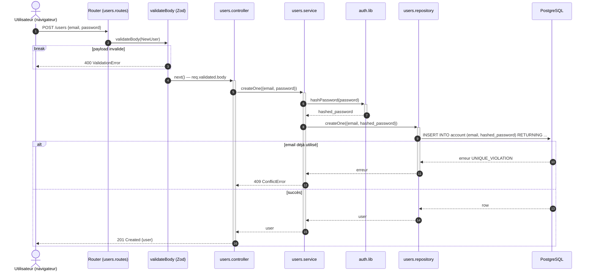

# Séquence — création de compte (livré)

Flux `POST /users` :

- [`users.routes.js`](../../src/features/users/users.routes.js)
- [`users.controller.js`](../../src/features/users/users.controller.js)
- [`users.service.js`](../../src/features/users/users.service.js)
- [`users.repository.js`](../../src/features/users/users.repository.js)

## Notes

- Validation stricte du body : le schéma `NewUser` (Zod) n'accepte que
  `email` et `password` — toute clé en plus ou en moins est rejetée avant
  d'atteindre le controller.
- Le mot de passe est haché (Argon2, `auth.lib.js`) à chaque création,
  sans condition — sur `PATCH /users/:id`, le hash n'a lieu que si le
  mot de passe fait partie des champs modifiés.
- Un email déjà utilisé remonte comme une contrainte Postgres
  (`UNIQUE_VIOLATION`), traduite en 409 `ConflictError` par
  `toDomainError`.
- Pas de vérification de compte (email, `verified_at`) dans ce flux —
  voir [`signup-verify-sequence.md`](signup-verify-sequence.md), design
  bonus non implémenté.
- `ValidationError` et `ConflictError` ne sont pas renvoyées explicitement
  par le controller : elles remontent jusqu'au middleware d'erreur global
  d'Express, qui les transforme en réponse HTTP — c'est pourquoi certaines
  branches du diagramme s'arrêtent sans flèche de retour vers l'utilisateur.
