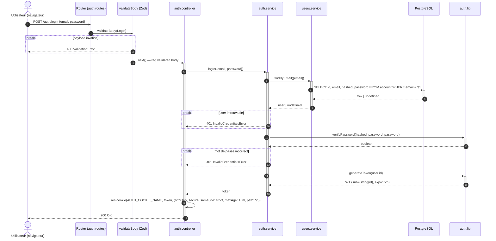

# Séquence — login (livré)

Flux `POST /auth/login` :

- [`auth.routes.js`](../../src/features/auth/auth.routes.js)
- [`auth.controller.js`](../../src/features/auth/auth.controller.js)
- [`auth.service.js`](../../src/features/auth/auth.service.js)
- [`auth.lib.js`](../../src/features/auth/auth.lib.js)

## Notes

- Le mot de passe est vérifié avec Argon2 (`verifyPassword`, `auth.lib.js`)
  contre le hash stocké en base — jamais de comparaison en clair.
- Le JWT (`generateToken`, payload `{ sub: id }`) expire après 15 minutes ;
  signé avec `JWT_SECRET`, une variable d'environnement, jamais en dur
  dans le code.
- Le cookie qui transporte le JWT a la même durée de vie que le token
  (`JWT_DURATION_MS`, `auth.config.js`) — les deux expirent ensemble,
  pas de cookie qui survivrait à un JWT déjà expiré.
- `ValidationError` et `InvalidCredentialsError` ne sont pas renvoyées
  explicitement par le controller : elles remontent jusqu'au middleware
  d'erreur global d'Express, qui les transforme en réponse HTTP — c'est
  pourquoi certaines branches du diagramme s'arrêtent sans flèche de
  retour vers l'utilisateur.
