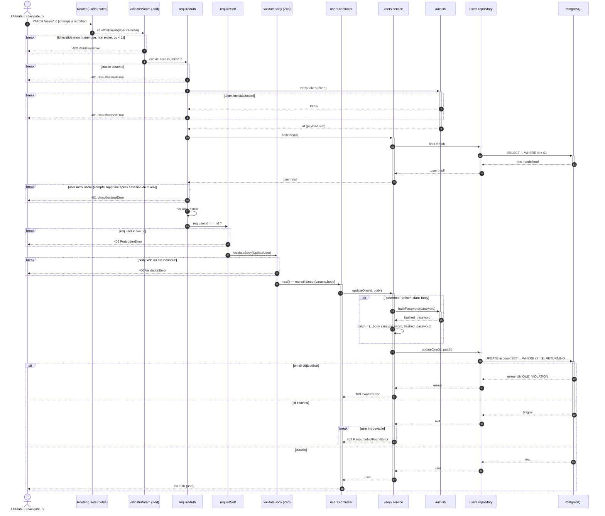

# Séquence — PATCH /users/:id (livré)

Flux `PATCH /users/:id` :

- [`users.routes.js`](../../src/features/users/users.routes.js)
- [`users.controller.js`](../../src/features/users/users.controller.js)
- [`users.service.js`](../../src/features/users/users.service.js)
- [`users.repository.js`](../../src/features/users/users.repository.js)
- [`requireAuth.js`](../../src/http/middlewares/requireAuth.js)
- [`requireSelf.js`](../../src/http/middlewares/requireSelf.js)

## Notes

- Express exécute le callback `.param("id", ...)` avant tous les
  middlewares de la route, quel que soit leur ordre de déclaration dans
  `.patch(...)` — c'est pourquoi `PARAM` valide l'ID avant `requireAuth`.
- Le participant `AUTH` regroupe le middleware `requireAuth` et
  `authService.checkAuth` qu'il appelle. Deux causes distinctes aboutissent
  toutes deux à un 401 : le JWT invalide/expiré (`verifyToken` lève une
  erreur), ou l'utilisateur introuvable (le compte a été supprimé après
  l'émission du token) — représentées comme deux `break` séparés pour ne
  pas cacher les deux appels réels (`Lib.verifyToken`, puis `S`→`Repo`→`DB`).
- Le middleware `requireSelf` compare `req.user.id` (posé par
  `requireAuth`) à l'`:id` de l'URL : un compte ne peut modifier que son
  propre profil, sinon 403 `ForbiddenError`.
- Le schéma `UpdateUser` (Zod) impose au moins un champ modifié et rejette
  toute clé hors `email`, `password`, `first_name`, `last_name`.
- Le mot de passe n'est re-haché (Argon2) que s'il fait partie des champs
  envoyés ; sinon, le reste du body est appliqué tel quel.
- La clause `SET` de la requête `UPDATE` est construite à partir d'une
  liste blanche de colonnes, jamais depuis les clés brutes du body — une
  clé absente du `patch` laisse la colonne existante intacte, et aucune
  colonne hors liste blanche ne peut être modifiée.
- Le conflit d'email (409) et l'utilisateur introuvable (404) sont deux
  issues possibles de la même requête `UPDATE` : `toDomainError` traduit
  une violation `UNIQUE_VIOLATION` Postgres en 409, et l'absence de ligne
  retournée (`null`) en 404.
- `ValidationError`, `UnauthorizedError`, `ForbiddenError`, `ConflictError`
  et `ResourceNotFoundError` ne sont pas renvoyées explicitement par le
  controller : elles remontent jusqu'au middleware d'erreur global
  d'Express, qui les transforme en réponse HTTP — c'est pourquoi certaines
  branches du diagramme s'arrêtent sans flèche de retour vers
  l'utilisateur.
