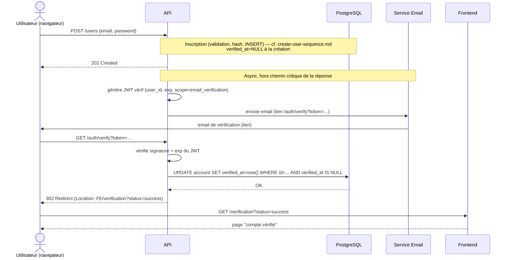

# Séquence — inscription + vérification de compte (non implémenté)

Flux `POST /users` puis `GET /auth/verify?token=...`, cas nominal uniquement
(pas de gestion d'erreur : token invalide/expiré/déjà utilisé).

## Décisions actées

- `GET /auth/verify` redirige (302) vers une page frontend, pas de réponse
  JSON brute (endpoint atteint par clic navigateur, pas par un client API).
