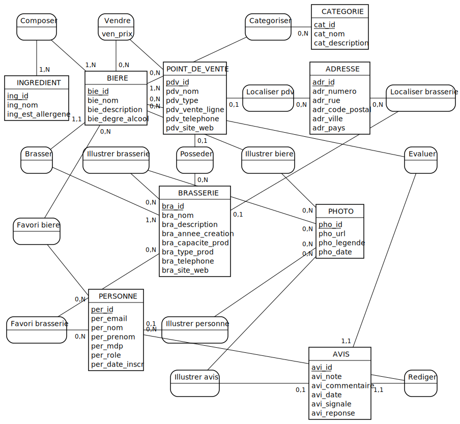

# MCD (Modèle Conceptuel de Données)

*Modèle Conceptuel de Données — généré depuis la source de vérité [`modeles/zytho.mcd`](../modeles/zytho.mcd).*

---

**Niveaux de modélisation :** MCD · [MLD](./mld.md) · [MPD](./mpd.md)
