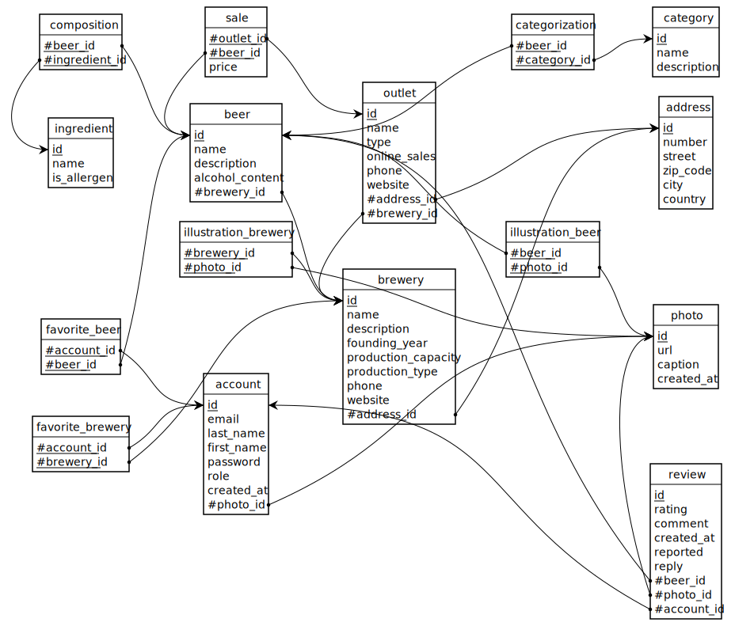

# MLD (Modèle Logique de Données)

*Passage du nommage conceptuel (FR) au nommage physique (EN).*

De gauche à droite :
* l'**entité** ([dictionnaire de données](./dictionnaire-donnees.md)) ou, pour un lien N:N, le **verbe d'association** du MCD ;
* à droite la **relation** (table) correspondante. Les tables de jonction portent un **nom sémantique** (verbe → table : `Vendre`→`sale`, `Composer`→`composition`…). PK soulignée, FK préfixée `#`.*

| Entité / Association (MCD, FR) | Relation (MLD, EN) |
|--|--|
| ADRESSE | **address** (<u>id</u>, number, street, zip_code, city, country) |
| AVIS | **review** (<u>id</u>, rating, comment, created_at, reported, reply, *#beer_id*, *#photo_id*, *#account_id*) |
| BIÈRE | **beer** (<u>id</u>, name, description, alcohol_content, *#brewery_id*) |
| BRASSERIE | **brewery** (<u>id</u>, name, description, founding_year, production_capacity, production_type, phone, website, *#address_id*) |
| CATÉGORIE | **category** (<u>id</u>, name, description) |
| INGRÉDIENT | **ingredient** (<u>id</u>, name, is_allergen) |
| PERSONNE | **account** (<u>id</u>, email, last_name, first_name, password, role, created_at, *#photo_id*) |
| PHOTO | **photo** (<u>id</u>, url, caption, created_at) |
| POINT DE VENTE | **outlet** (<u>id</u>, name, type, online_sales, phone, website, *#address_id*, *#brewery_id*) |
| Catégoriser | **categorization** (<u>*#beer_id*</u>, <u>*#category_id*</u>) |
| Composer | **composition** (<u>*#beer_id*</u>, <u>*#ingredient_id*</u>) |
| Favori bière | **favorite_beer** (<u>*#account_id*</u>, <u>*#beer_id*</u>) |
| Favori brasserie | **favorite_brewery** (<u>*#account_id*</u>, <u>*#brewery_id*</u>) |
| Illustrer bière | **illustration_beer** (<u>*#beer_id*</u>, <u>*#photo_id*</u>) |
| Illustrer brasserie | **illustration_brewery** (<u>*#brewery_id*</u>, <u>*#photo_id*</u>) |
| Vendre | **sale** (<u>*#outlet_id*</u>, <u>*#beer_id*</u>, price) |

---

**Niveaux de modélisation :** [MCD](./mcd.md) · MLD · [MPD](./mpd.md)
