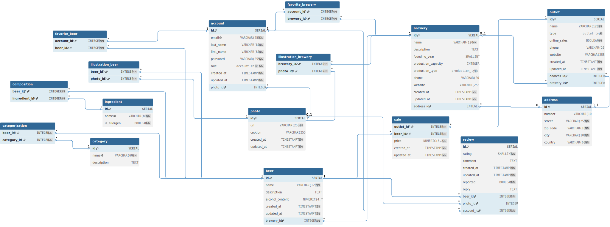

# MPD (Modèle Physique de Données)

> *Convention MPD :*
> * cible PostgreSQL.
> * identifiants en anglais (tables, colonnes, contraintes).
> * PK = `id`
> * FK = `<table>_id`

  

[*lien publique vers le schema dbDiagram.io*](https://dbdiagram.io/d/6a297a709340ecc0656b6baf)
> Implémentation de référence : [`sql/01_create_schema.sql`](../sql/01_create_schema.sql).*

## Domaines (types ENUM)

| Type | Valeurs |
|--|--|
| `account_role` | `customer`, `brewer`, `admin` |
| `production_type` | `craft`, `industrial`, `microbrewery` |
| `outlet_type` | `cellar`, `bar`, `restaurant`, `supermarket` |

> La colonne **Code** renvoit à l'équivalent du [dictionnaire de données](./dictionnaire-donnees.md)

## ADDRESS

| Code | Colonne | Type | Contraintes |
|--|--|--|--|
| adr_id | id | SERIAL | PK |
| adr_numero | number | VARCHAR(10) | |
| adr_rue | street | VARCHAR(255) | NOT NULL |
| adr_code_postal | zip_code | VARCHAR(10) | NOT NULL |
| adr_ville | city | VARCHAR(100) | NOT NULL |
| adr_pays | country | VARCHAR(60) | NOT NULL, DEFAULT `'France'` |

## PHOTO

| Code | Colonne | Type | Contraintes |
|--|--|--|--|
| pho_id | id | SERIAL | PK |
| pho_url | url | VARCHAR(255) | NOT NULL |
| pho_legende | caption | VARCHAR(255) | |
| pho_date | created_at | TIMESTAMPTZ | NOT NULL, DEFAULT `now()` |

## CATEGORY

| Code | Colonne | Type | Contraintes |
|--|--|--|--|
| cat_id | id | SERIAL | PK |
| cat_nom | name | VARCHAR(60) | NOT NULL, UNIQUE |
| cat_description | description | TEXT | |

## INGREDIENT

| Code | Colonne | Type | Contraintes |
|--|--|--|--|
| ing_id | id | SERIAL | PK |
| ing_nom | name | VARCHAR(80) | NOT NULL, UNIQUE |
| ing_est_allergene | is_allergen | BOOLEAN | NOT NULL, DEFAULT `false` |

## ACCOUNT

| Code | Colonne | Type | Contraintes |
|--|--|--|--|
| per_id | id | SERIAL | PK |
| per_email | email | VARCHAR(255) | NOT NULL, UNIQUE |
| per_nom | last_name | VARCHAR(80) | NOT NULL |
| per_prenom | first_name | VARCHAR(80) | NOT NULL |
| per_mdp | password | VARCHAR(255) | NOT NULL |
| per_role | role | `account_role` | NOT NULL, DEFAULT `'customer'` |
| per_date_inscr | created_at | TIMESTAMPTZ | NOT NULL, DEFAULT `now()` |
| — | updated_at | TIMESTAMPTZ | NOT NULL, DEFAULT `now()` (trigger) |
| — | photo_id | INTEGER | FK → photo (ON DELETE SET NULL) |

## BREWERY

| Code | Colonne | Type | Contraintes |
|--|--|--|--|
| bra_id | id | SERIAL | PK |
| bra_nom | name | VARCHAR(120) | NOT NULL |
| bra_description | description | TEXT | |
| bra_annee_creation | founding_year | SMALLINT | |
| bra_capacite_prod | production_capacity | INTEGER | CHECK (> 0) |
| bra_type_prod | production_type | `production_type` | |
| bra_telephone | phone | VARCHAR(20) | |
| bra_site_web | website | VARCHAR(255) | |
| — | created_at | TIMESTAMPTZ | NOT NULL, DEFAULT `now()` |
| — | updated_at | TIMESTAMPTZ | NOT NULL, DEFAULT `now()` (trigger) |
| — | address_id | INTEGER | FK → address (ON DELETE SET NULL) |

## BEER

| Code | Colonne | Type | Contraintes |
|--|--|--|--|
| bie_id | id | SERIAL | PK |
| bie_nom | name | VARCHAR(120) | NOT NULL |
| bie_description | description | TEXT | |
| bie_degre_alcool | alcohol_content | NUMERIC(4,2) | CHECK (0 ≤ alcohol_content ≤ 100) |
| — | created_at | TIMESTAMPTZ | NOT NULL, DEFAULT `now()` |
| — | updated_at | TIMESTAMPTZ | NOT NULL, DEFAULT `now()` (trigger) |
| — | brewery_id | INTEGER | NOT NULL, FK → brewery (ON DELETE RESTRICT) |

## OUTLET

| Code | Colonne | Type | Contraintes |
|--|--|--|--|
| pdv_id | id | SERIAL | PK |
| pdv_nom | name | VARCHAR(120) | NOT NULL |
| pdv_type | type | `outlet_type` | |
| pdv_vente_ligne | online_sales | BOOLEAN | NOT NULL, DEFAULT `false` |
| pdv_telephone | phone | VARCHAR(20) | |
| pdv_site_web | website | VARCHAR(255) | |
| — | created_at | TIMESTAMPTZ | NOT NULL, DEFAULT `now()` |
| — | updated_at | TIMESTAMPTZ | NOT NULL, DEFAULT `now()` (trigger) |
| — | address_id | INTEGER | FK → address (ON DELETE SET NULL) |
| — | brewery_id | INTEGER | FK → brewery (ON DELETE SET NULL) |
| | | | CHECK (address_id NOT NULL OR online_sales) — adresse et/ou vente en ligne |

## REVIEW

| Code | Colonne | Type | Contraintes |
|--|--|--|--|
| avi_id | id | SERIAL | PK |
| avi_note | rating | SMALLINT | NOT NULL, CHECK (1 ≤ rating ≤ 5) |
| avi_commentaire | comment | TEXT | |
| avi_signale | reported | BOOLEAN | NOT NULL, DEFAULT `false` |
| avi_reponse | reply | TEXT | |
| avi_date | created_at | TIMESTAMPTZ | NOT NULL, DEFAULT `now()` |
| — | updated_at | TIMESTAMPTZ | NOT NULL, DEFAULT `now()` (trigger) |
| — | beer_id | INTEGER | NOT NULL, FK → beer (ON DELETE CASCADE) |
| — | photo_id | INTEGER | FK → photo (ON DELETE SET NULL) |
| — | account_id | INTEGER | NOT NULL, FK → account (ON DELETE CASCADE) |
| | | | UNIQUE (account_id, beer_id) — 1 avis par compte et par bière |

## CATEGORIZATION

| Code | Colonne | Type | Contraintes |
|--|--|--|--|
| — | beer_id | INTEGER | PK, FK → beer (ON DELETE CASCADE) |
| — | category_id | INTEGER | PK, FK → category (ON DELETE RESTRICT) |

## COMPOSITION

| Code | Colonne | Type | Contraintes |
|--|--|--|--|
| — | beer_id | INTEGER | PK, FK → beer (ON DELETE CASCADE) |
| — | ingredient_id | INTEGER | PK, FK → ingredient (ON DELETE CASCADE) |

## FAVORITE_BEER

| Code | Colonne | Type | Contraintes |
|--|--|--|--|
| — | account_id | INTEGER | PK, FK → account (ON DELETE CASCADE) |
| — | beer_id | INTEGER | PK, FK → beer (ON DELETE CASCADE) |

## FAVORITE_BREWERY

| Code | Colonne | Type | Contraintes |
|--|--|--|--|
| — | account_id | INTEGER | PK, FK → account (ON DELETE CASCADE) |
| — | brewery_id | INTEGER | PK, FK → brewery (ON DELETE CASCADE) |

## ILLUSTRATION_BEER

| Code | Colonne | Type | Contraintes |
|--|--|--|--|
| — | beer_id | INTEGER | PK, FK → beer (ON DELETE CASCADE) |
| — | photo_id | INTEGER | PK, FK → photo (ON DELETE CASCADE) |

## ILLUSTRATION_BREWERY

| Code | Colonne | Type | Contraintes |
|--|--|--|--|
| — | brewery_id | INTEGER | PK, FK → brewery (ON DELETE CASCADE) |
| — | photo_id | INTEGER | PK, FK → photo (ON DELETE CASCADE) |

## SALE

| Code | Colonne | Type | Contraintes |
|--|--|--|--|
| — | outlet_id | INTEGER | PK, FK → outlet (ON DELETE CASCADE) |
| — | beer_id | INTEGER | PK, FK → beer (ON DELETE CASCADE) |
| ven_prix | price | NUMERIC(8,2) | NOT NULL, CHECK (> 0) |
| — | created_at | TIMESTAMPTZ | NOT NULL, DEFAULT `now()` |
| — | updated_at | TIMESTAMPTZ | NOT NULL, DEFAULT `now()` (trigger) |

---

**Niveaux de modélisation :** [MCD](./mcd.md) · [MLD](./mld.md) · MPD
